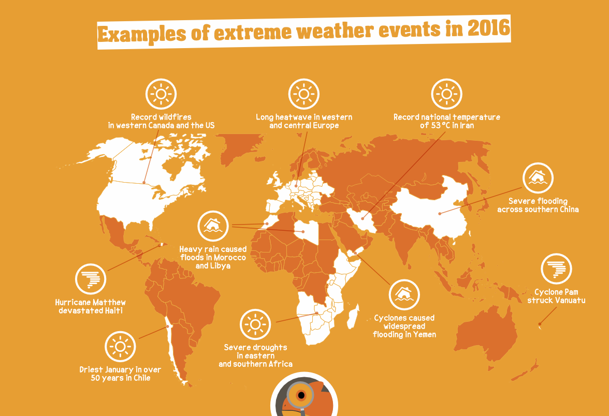

# HuggingFaceTB/SmolVLM-Instruct Cog model

This is an implementation of [HuggingFaceTB/SmolVLM-Instruct](https://huggingface.co/HuggingFaceTB/SmolVLM-Instruct) as a [Cog](https://github.com/replicate/cog) model.

## Development

Follow the [model pushing guide](https://replicate.com/docs/guides/push-a-model) to push your own model to [Replicate](https://replicate.com).

## Setup

Download weights:

    pip install huggingface-hub
    huggingface-cli download HuggingFaceTB/SmolVLM-Instruct --local-dir checkpoints

## Basic Usage

To run a prediction:

    cog predict -i image=@weather.png -i prompt="Where do the severe droughts happen according to this diagram?"

Output

    The severe droughts happen in eastern and southern Africa.